# credit_risk
## Analysis of large amount of data to identify risk of borrowers that may not pay back loans using Machine Learning Algorithms.

A large data set with statistics of loans and information on the borrowers is presented for analysis.  The status of each of the loans in the data set which belongs to low risk and high risk is used to make predictions.  The objective is analyze a large amount of data to arrive at the decision to approve or not approve a loan and while identifying the risk of borrowers that may not pay loans.  

The tools used to analyze the credit risk are:

* Python
* Scikit-learn 

The dataset is loaded and using pandas, a dataframe is created and transformed for use.

As a standard machine learning step, the data is split into input and output for training and testing.  The target variable which is the loan status is the input (without the loan status itself) and the target variable containing the loan status of low risk or high risk is the output.  There are 51366 low risk loans and 246 high risk loans in the output.

The data is then split into a training set and testing set for the input and output variables.  The model uses the training dataset to learn from it. It then uses the testing dataset to assess its performance.  Random state of 1 is used to make the data reproducible and ensures that the same rows are assigned to train and test sets, respectively.

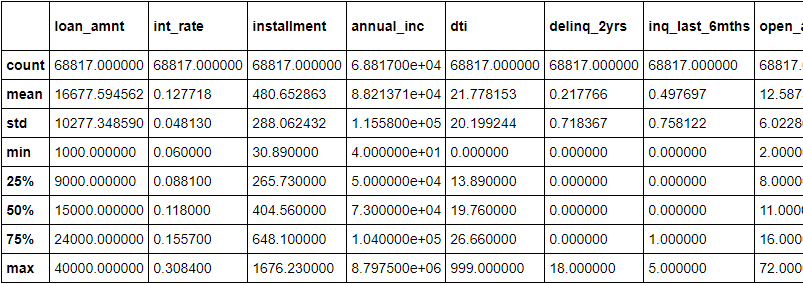

## Ensemble

The concept of ensemble learning is the process of combining multiple models, like decision tree algorithms, to help improve the accuracy and robustness, as well as decrease variance of the model, and therefore increase the overall performance of the model.

There are two ensemble algorithms used here to determine which results in the best performance.
* Balanced Random Forest Classifier
* Easy Ensemble AdaBoost Classifier

### Balanced Random Forest Classifier

Random forest involves selecting bootstrap samples from the training dataset and fitting a decision tree on each.  A small, randomly selected subset of features (columns) is chosen for each bootstrap sample. This has the effect of de-correlating the decision trees (making them more independent), and in turn, improving the ensemble prediction.

The Balanced Random Forest Classifier class from the imbalanced-learn library performs random undersampling of the majority class in reach bootstrap sample.

The accuracy score predicted by this method is 0.788 which is relatively poor and the confusion matrix is as below

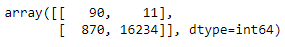

In the context of high-risk loan status prediction:

90 loans are predicted to be high-risk loans and the prediction has been true.  The model also predicted 870 of the high-risk loans falsely low-risk.

The model also predicted 11 low-risk loans which were in fact high-risk.  It also predicted 16234 loans as low-risk and they were true.

The classification report generated is as below.

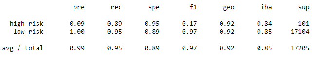

The F1 score for high risk prediction is low meaning there is a pronounced imbalance between sensitivity and precision.

### Easy Ensemble AdaBoost Classifier

The Easy Ensemble on the contrary involves creating balanced samples of the training dataset by selecting all examples from the minority class and a subset from the majority class.  Rather than using pruned decision trees, boosted decision trees are used on each subset, specifically the AdaBoost algorithm.

AdaBoost works by first fitting a decision tree on the dataset, then determining the errors made by the tree and weighing the examples in the dataset by those errors so that more attention is paid to the misclassified examples and less to the correctly classified examples. A subsequent tree is then fit on the weighted dataset intended to correct the errors. The process is then repeated for a given number of decision trees.

The accuracy score predicted by this method is 0.92 which means an improved percentage of the testing set was predicted correctly by the model.  The confusion matrix is as below

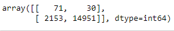

In the context of high-risk loan status prediction:

71 loans are predicted to be high-risk loan status and the prediction has been true.  The model also predicted 2153 of the high-risk loans falsely low-risk.

The model also predicted 30 low-risk loans which were in fact high-risk.  It also predicted 14951 loans as low-risk and they were true.

The classification report generated is as below.

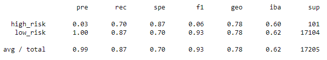

The F1 score for the high-risk prediction is very low meaning there is a pronounced imbalance between sensitivity and precision.  However, it is better than the Balanced Random Forest Classifier model.

## Resampling

A second machine learning analysis is performed using the oversampling, undersampling and combination algorithms:

* Naïve Random Oversampling
* Smote Oversampling
* Undersampling
* Combination (Over and Under) Sampling

### Naïve Random Oversampling

In random oversampling, instances of the minority class are randomly selected and added to the training set until the majority and minority classes are balanced. 
The counter using this algorithm, low risk loans 51366 and high risk loans 51366 indicates that the minority which is the high risk loan is now balanced.  Hence the dataset is now resampled for predictions.
LogisticRegression model is used to train and the model creates predictions from the resampled dataset.  The confusion matrix is indicated as below.

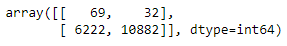

In the context of high-risk loan status prediction:

69 loans are predicted to be high-risk loan status and the prediction has been true.  The model also predicted 6222 of the high-risk loans falsely.

The model also predicted 32 low-risk loans which were in fact high-risk.  It also predicted 10882 loans as low-risk and they were true.  As we see from the confusion matrix and the accuracy calculation of 0.659, the model is highly inaccurate.

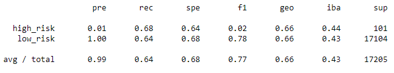

The F1 score for the high-risk prediction is very low meaning there is a pronounced imbalance between sensitivity and precision.

### Smote Oversampling
Like random oversampling, the size of the minority is increased in Synthetic Minority Oversampling Technique (SMOTE).  In SMOTE, new instances are interpolated from the minority class, with a number of its closest neighbors rather than random sampling.

The counter using this algorithm, low risk loans 51366 and high risk loans 51366 indicates that the minority which is the high risk loan is now balanced.  Hence the dataset is now resampled for predictions.
LogisticRegression model is used to train and the model creates predictions from the resampled dataset.  The confusion matrix is indicated as below.

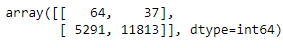

In the context of high-risk loan status prediction:

64 loans are predicted to be high-risk loan status and the prediction has been true.  The model also predicted 5291 of the high-risk loans falsely.

The model also predicted 37 low-risk loans which were in fact high-risk.  It also predicted 11813 loans as low-risk and they were true.  As we see from the confusion matrix and the accuracy calculation of 0.66, the model is highly inaccurate.

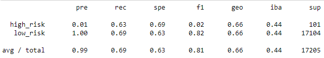

The F1 score for the high-risk prediction is very low and is the same as that of the ROS, meaning there is a pronounced imbalance between sensitivity and precision.

### Undersampling
In undersampling, the size of the majority class is decreased.  This results in loss of data.
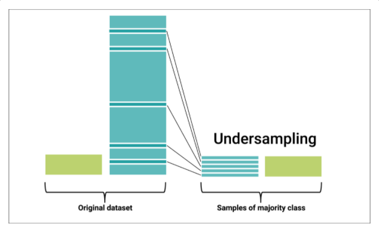

The counter using this algorithm, low risk loans 246 and high risk loans 246 indicates that the majority is now made to balance with the minority.  Hence the dataset is now resampled for predictions.
LogisticRegression model is used to train and the model creates predictions from the resampled dataset.  The confusion matrix is indicated as below.

In the context of high-risk loan status prediction:

69 loans are predicted to be high-risk loan status and the prediction has been true.  The model also predicted 10072 of the high-risk loans falsely.

The model also predicted 32 low-risk loans which were in fact high-risk.  It also predicted 7032 loans as low-risk and they were true.  As we see from the confusion matrix and the accuracy calculation of 0.66, the model is highly inaccurate.

The F1 score for the high-risk prediction is lower than that of the ROS, meaning there is a even more pronounced imbalance between sensitivity and precision.

### Combination (Over and Under) Sampling
In combination (over and under) sampling also known as SMOTEENN:
•	the minority class is oversampled with SMOTE
•	clean the resulting data with an undersampling strategy.  If the two nearest neighbors of a data point belong to two different classes, that data point is dropped.
The counter using this algorithm, low risk loans 246 and high risk loans 246 indicates that the majority is now made to balance with the minority.  Hence the dataset is now resampled for predictions.
LogisticRegression model is used to train and the model creates predictions from the resampled dataset.  The confusion matrix is indicated as below.

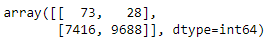

In the context of high-risk loan status prediction:

73 loans are predicted to be high-risk loan status and the prediction has been true.  The model also predicted 7416 of the high-risk loans falsely.

The model also predicted 28 low-risk loans which were in fact high-risk.  It also predicted 9688 loans as low-risk and they were true.  As we see from the confusion matrix and the accuracy calculation of 0.54, the model is poor.

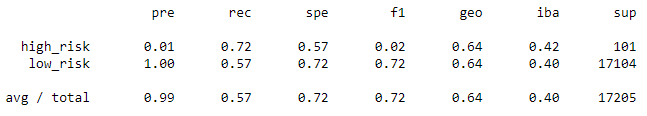

The F1 score for the high-risk prediction is very low, meaning there is a pronounced imbalance between sensitivity and precision.
